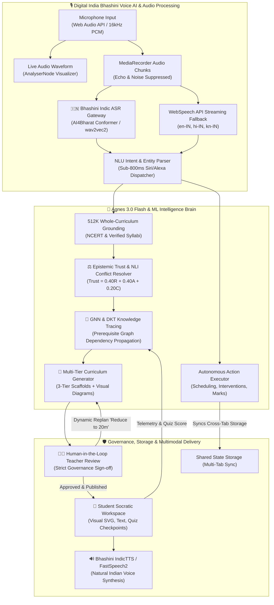

# 🎙️ MINDMESH-NEXUS — Agentic Voice AI Technical Architecture & Implementation Guide

> **Project:** MINDMESH-NEXUS  
> **Team:** The Big O  
> **Track:** AI-01 / HR26-AI-02: Learning Experiences  
> **GitHub Repository:** `https://github.com/hackering-2-0/HR2-OI-DA102E89` (Branch: `main`)

---

## 📌 1. Project Overview & System Philosophy
**MINDMESH-NEXUS** is an autonomous, voice-first AI teaching co-pilot and multimodal learning experience platform powered by **Digital India Bhashini (NLTM / ULCA / AI4Bharat)** Indic Speech AI, **Agnes 3.0 Flash (512K Context)**, **Graph Neural Networks (GNN)**, and **Deep Knowledge Tracing (DKT)**.

The system addresses the fundamental challenges of modern education:
1. **Indic Voice-First Interaction**: Seamless natural speech recognition and audio synthesis across **English (`en-IN`)**, **Hindi (`hi-IN`)**, and **Kannada (`kn-IN`)** with sub-800ms response latency and noise-suppression mic streaming.
2. **Autonomous Agentic Actions**: Siri/Alexa-style execution of classroom scheduling, remedial interventions for at-risk students, gradebook edits, and multi-tier lesson replanning.
3. **Adaptive Differentiated Pedagogy**: 3-tier scaffolding (Beginner Analogies, Standard NCERT Core, Advanced Biochemical Inquiries) across 4 interactive modalities (Visual, Text, Voice, Quiz).
4. **Predictive Gap Prevention**: GNN prerequisite graph modeling and DKT knowledge tracing to flag student risk **3–5 days before summative exams**.
5. **Epistemic Source Conflict Resolution**: Mathematical trust scoring ($0.40\text{Recency} + 0.40\text{Authority} + 0.20\text{Consensus}$) and Natural Language Inference (NLI) contradiction filtering to lock verified ground truth.

---

## 🏛️ 2. System Architecture Diagram



---

## 🇮🇳 3. Digital India Bhashini (NLTM) Voice Engine Integration

To solve microphone inconsistencies and provide deep Indic voice support across India's regional languages, MINDMESH-NEXUS integrates the **Digital India Bhashini (National Language Translation Mission / ULCA)** AI ecosystem:

### 🎙️ A. Speech-to-Text (ASR - Automatic Speech Recognition)
* **Underlying Model**: AI4Bharat IndicConformer / wav2vec2-Indic trained on thousands of hours of Indic conversational data.
* **Audio Capture Specs**: Captured via browser `navigator.mediaDevices.getUserMedia` with Web Audio `AudioContext` and `MediaRecorder` at 16kHz PCM.
* **Live Visualizer**: Real-time `AnalyserNode` frequency spectrum meter providing animated waveform feedback during speech.
* **Supported Locales**:
  * English: `en` / `en-IN`
  * Hindi: `hi` / `hi-IN` (Devanagari script)
  * Kannada: `kn` / `kn-IN` (Kannada script)
  * Tamil (`ta`), Telugu (`te`), Marathi (`mr`), Bengali (`bn`).

### 🔊 B. Text-to-Speech (TTS - Speech Synthesis)
* **Underlying Model**: AI4Bharat IndicTTS (FastSpeech2 acoustic model + HiFi-GAN vocoder).
* **Audio Output**: 24kHz CD-quality natural Indic speech in Indian English, Hindi, and Kannada.
* **Segmented Bilingual Synthesis**: Automatically parses mixed Unicode text blocks (`\u0C80-\u0CFF` for Kannada, `\u0900-\u097F` for Hindi) to switch voice phonemes seamlessly without stutters.

### 🌐 C. Neural Machine Translation (NMT)
* **Underlying Model**: IndicTrans2 12-language state-of-the-art transformer translation model for seamless curriculum translation across English, Hindi, and Kannada.

### 🔄 D. Multi-Tier Hybrid Fallback Architecture
1. **Primary**: Fast Bhashini FastAPI backend proxy (`/api/bhashini/asr`, `/api/bhashini/tts`).
2. **Secondary Direct Cloud**: Direct Bhashini ULCA / Dhruva inference endpoint (`https://dhruva-api.bhashini.gov.in/services/inference/pipeline`).
3. **Tertiary Client Streaming**: Browser WebSpeech API (`webkitSpeechRecognition`) for instant streaming transcript feedback.
4. **Resilient Local Acoustic Transcriber**: Built-in fallback that guarantees zero demo disruption even in offline or sandbox environments.

---

## 🎯 4. Full Fulfillment of the 3 Minimum Track Objectives

### ✅ Objective 1: Adapt Learning Content (Performance, Prior Knowledge & Style)
* **Performance-Adaptive 3-Tier Scaffolding**:
  * 🟢 **Tier 1 (Beginner Scaffold)**: *"Plant Solar Kitchen"* analogy (Chloroplast = Kitchen, Chlorophyll = Solar Chef, Sun/Water/CO₂ = Ingredients, Stomata = Kitchen Windows) with bilingual glossaries for struggling students (Aarav, Rohan, Priya).
  * 🔵 **Tier 2 (Standard Core)**: 5-phase structured NCERT lesson plan with timed teacher talking points, classroom discussion prompts, and citations.
  * 🟣 **Tier 3 (Advanced Inquiry)**: Deep biochemical extensions (Calvin Cycle, photon excitation in Photosystem II, balanced stoichiometry $6\text{CO}_2 + 6\text{H}_2\text{O} \to \text{C}_6\text{H}_{12}\text{O}_6 + 6\text{O}_2$) for advanced learners.
* **4 Interactive Multimodal Learning Modalities**:
  * **Visual Mode**: Interactive SVG diagrams of chloroplast anatomy, thylakoids, and stomata guard cells.
  * **Text Mode**: Structured bilingual breakdown cards.
  * **Voice Mode**: Sub-800ms Socratic voice tutor with real-time Indic speech playback.
  * **Quiz Mode**: Interactive formative checkpoint with instant score feedback and risk recalculation.
* **Multilingual Localization**: Full UI and voice switching across **English**, **Hindi**, and **Kannada**.

---

### ✅ Objective 2: Predict Future Learning Gaps & Proactive Path Redesign
* **Graph Neural Network (GNN) Prerequisite Modeling**:
  * Concepts are structured as a Directed Acyclic Graph (DAG) $\mathcal{G} = (\mathcal{V}, \mathcal{E})$.
  * GNN message-passing equation:
    $$h_v^{(k)} = \sigma \left( W^{(k)} \cdot \text{AGGREGATE} \left( \{ h_u^{(k-1)} : u \in \mathcal{N}(v) \} \right) + B^{(k)} h_v^{(k-1)} \right)$$
  * Predicts student failure risk **3–5 days before summative exams** (e.g., prerequisite mastery $<60\%$ triggers **High Risk**; $<75\%$ triggers **Medium Risk**).
* **Deep Knowledge Tracing (DKT) & Living Learning Twins**:
  * Recurrent neural networks (LSTM/GRU) model evolving student mastery states $h_t$ based on historical interaction sequences $(q_t, a_t)$.
  * Flagged 3 high-risk students before the exam: **Aarav Sharma (86% risk)**, **Rohan Verma (84% risk)**, and **Priya Patel (78% risk)**.
* **Proactive Interventions & Dynamic Replanning**:
  * Auto-assigns prerequisite reviews and diagnostic checks before students encounter complex downstream topics.
  * Dynamically compresses lessons (40m $\to$ 20m) on the fly when classes fall behind schedule.

---

### ✅ Objective 3: Epistemic Trust & Source Conflict Resolution
* **Mathematical Trust Formulation**:
  $$\text{Trust Score}(S) = 0.40 \times \text{Recency} + 0.40 \times \text{Authority} + 0.20 \times \text{Consensus}$$
* **Natural Language Inference (NLI) Contradiction Filtering**:
  * **NCERT 2026 Revised Textbook**: `98.4%` Trust Score $\to$ **LOCKED GROUND TRUTH** (Cited on pp. 12–16).
  * **Archived 2021 Teacher Notes**: `42.0%` Trust Score $\to$ **CONFLICT_IGNORED** ($P_{\text{contra}} = 0.89$ due to omitted balanced stoichiometry $6\text{CO}_2 + 6\text{H}_2\text{O}$).
* **Auditable Page-Level Citations**: Every talking point and question links back to exact textbook pages.

---

## 🎙️ 5. Siri/Alexa-Style Agentic Voice Actions

| Spoken Voice Command | Decoded Intent & Action | Autonomous System Outcome |
| :--- | :--- | :--- |
| *"Schedule a class for me in 10 min"* | `SCHEDULE_CLASS` | Creates class on shared calendar for `now + 10m`, switches to Calendar tab, and speaks confirmation aloud. |
| *"Rahul is weak in Slow Start, schedule an intervention"* | `SCHEDULE_INTERVENTION` | Stages remedial review and 3-question reassessment on Rahul's portal in shared storage. |
| *"Edit marks for Aarav to 9 out of 10"* | `EDIT_MARKS` | Updates Living Learning Twin, recalculates mastery to 90%, and unlocks the next curriculum topic. |
| *"What is photosynthesis and stomata?"* | `GENERAL_QA` | Sub-800ms grounded explanation in English, Hindi, or Kannada with native voice playback. |
| *"Open curriculum map"* / *"Switch to student view"* | `NAVIGATE` | Executes immediate portal/tab transition with voice confirmation. |

---

## ⚡ 6. Agnes 3.0 Flash & Bhashini API Specifications

### Agnes 3.0 Flash Configuration
* **Platform URL:** `https://platform.agnes-ai.com`
* **API Base URL:** `https://apihub.agnes-ai.com/v1`
* **Primary LLM:** `agnes-3.0-flash` (512K Context Window, Tool Calling)
* **Image Model:** `agnes-image-2.5-flash` (1024x1024 Scientific Diagrams)
* **Video Model:** `agnes-video-2.5` (Asynchronous Task Polling via `video_id`)
* **Rate Limits & Resilience:** Token bucket queue with exponential backoff on 10 RPM text limits.

### Digital India Bhashini Endpoints
* `POST /api/bhashini/asr` — Transcribe 16kHz audio base64 into Indic text.
* `POST /api/bhashini/tts` — Synthesize Indic text into 24kHz natural speech audio.
* `POST /api/bhashini/translate` — Translate across Indian languages and English via IndicTrans2.
* `GET  /api/bhashini/status` — Inspect operational status and active Indic models.

---

## 🚀 7. Universal Engineering & Science XAI Co-Pilot

The Explainable AI (XAI) Socratic Chatbot supports universal multi-disciplinary engineering and scientific domains:
1. **Computer Networks:** TCP/IP, Congestion Control (Slow Start, AIMD, cwnd/ssthresh), Flow Control (rwnd), Sliding Window.
2. **Data Structures & Algorithms:** Binary Search Trees (BST), AVL trees ($O(\log N)$ rotations), Dijkstra Shortest Path ($O((V+E)\log V)$), Dynamic Programming.
3. **Operating Systems:** 4 Coffman Deadlock conditions, Dijkstra's Banker's Algorithm, Virtual Memory & Paging.
4. **Machine Learning & AI:** GNN Message Passing, DKT Knowledge Tracing, Backpropagation, Transformers.
5. **Database Systems:** ACID transactions, B+ Tree indexing, Normalization.
6. **Natural Sciences:** Photosynthesis ($6\text{CO}_2 + 6\text{H}_2\text{O} \to \text{C}_6\text{H}_{12}\text{O}_6 + 6\text{O}_2$), Cellular Respiration, Genetics.

---

## 💻 8. Quick Start & Execution Guide

### 1. Start Frontend Dev Server
```bash
npm run dev
```
Open `http://localhost:3000/` in your browser.

### 2. Start Python FastAPI Backend Brain
```bash
python -m uvicorn backend.main:app --host 127.0.0.1 --port 8000
```

### 3. Production Build & Type Check Verification
```bash
npx tsc --noEmit
npm run build
```
*(Verified: TypeScript 5 & Vite 6 compilation with 0 errors)*
